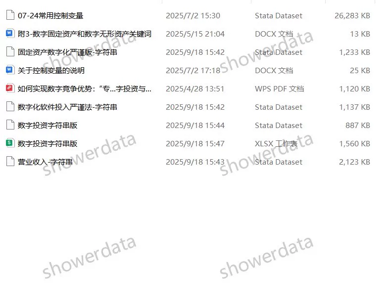
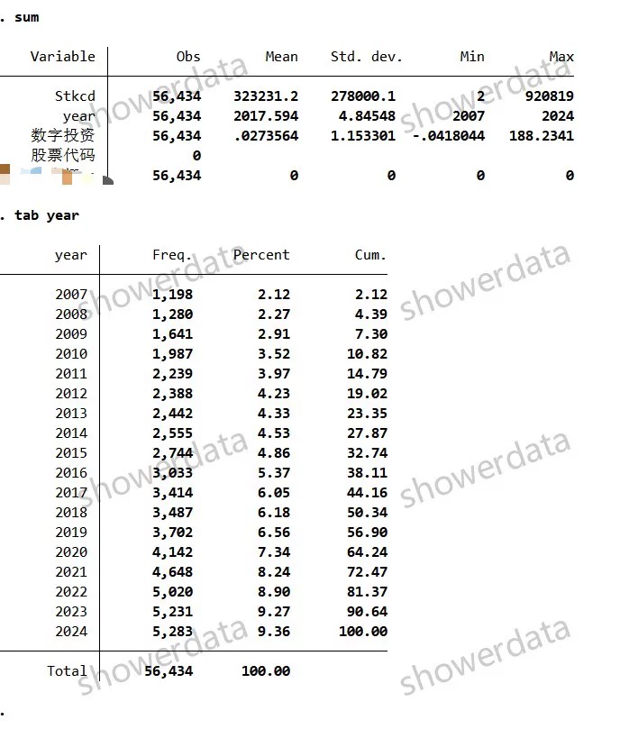
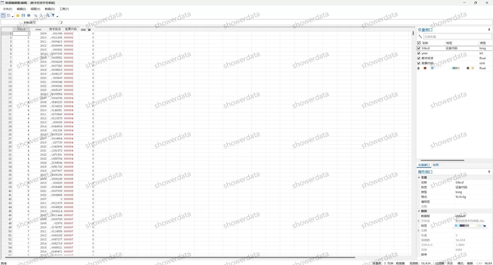

## Body

上市公司企业数字投资数据（2007-2024年）

一、数据介绍
数据名称：上市公司企业数字投资数据
样本范围：A鼓尚视公司, 5.6w+观测值，没有专门提供专精特部分
时间范围：2007-2024年
数据格式：Excel+Dta格式（Excel版建议调整下小数显示位数，不然的话看起来有很多0）, 无dofile

二、数据结果指标如图所示

三、计算方法
数据处理：相较于数字化转型无形资产法，本数据考虑了企业硬件设施的投入；缩尾部分（以w作为尾缀）仅展示（建议买家在剔除样本后在进行缩尾）

四、参考文献
[1]孙忠娟,刘凯月,冯佳林,等.如何实现数字竞争优势：“专精特新”企业数字投资与专业投资的协同逻辑[J].中国工业经济,2025,(04):156-173.DOI:10.19581/j.cnki.ciejournal.2025.04.008.

## Images

Here is a pay link on Stripe ( https://buy.stripe.com/3cs8yP7sY87d0vu9AB ). Please contact me lonlonago@foxmail.com after funding $89, and I will send you a complete data files , thank you!

